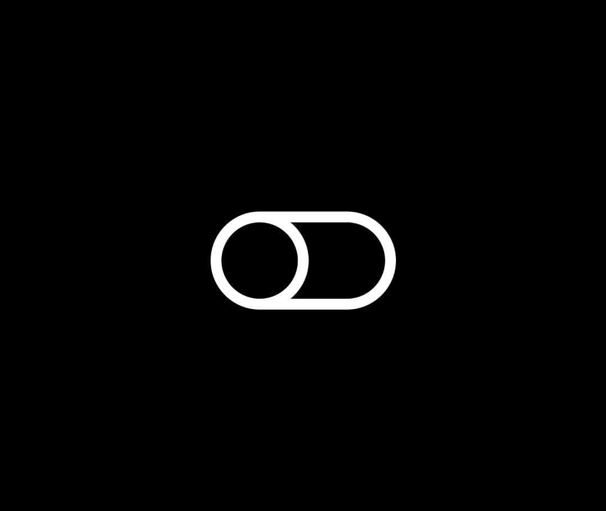
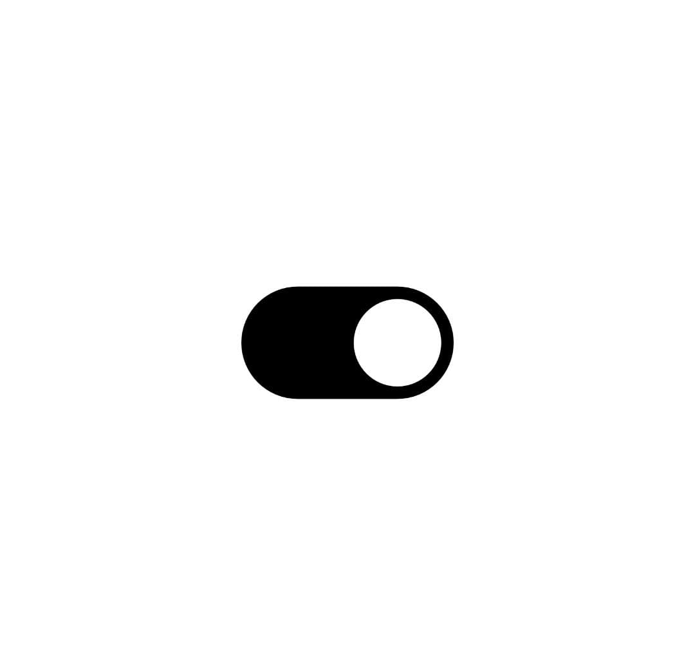

# App Utilizando ReactNative 

Lanterna desenvolvida utilizando ReactNative. 

# Conteúdo

- Libs react-native-shake e react-native-torch
- Stylesheets
- Hook useState
- Hook useEffect
- Add Listener to RNShake
- Sobre o projeto
Flashlight é um aplicativo de lanterna desenvolvido através do bootcamp Decola Tech 3a Edição da DIO com Avanade , utilizando o framework React Native.